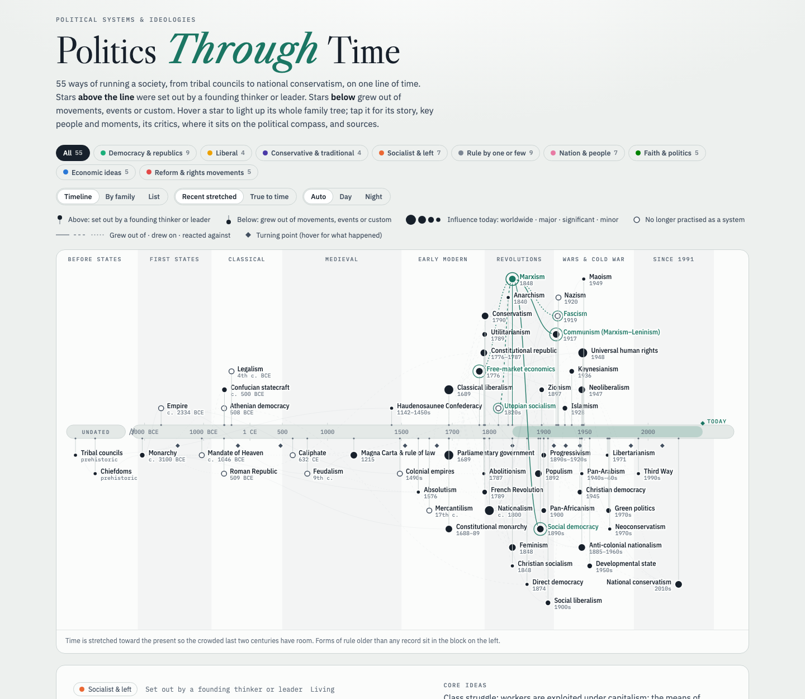

# Politics Through Time

An interactive star-chart timeline of **55 political systems and ideologies**, from tribal councils and the first kings to neoliberalism, populism and national conservatism.

**Live page:** https://petrogko.com/politics-history-timeline/



## How to read it

- **The band across the middle is time.** By default recent centuries are stretched, because almost every modern ideology is less than 250 years old; switch to **True to time** to see every century at the same width.
- **Above the line:** set out by a founding thinker or leader (Locke, Burke, Marx, Keynes…). **Below:** grew out of movements, events or custom (parliament, nationalism, populism…).
- **Star size:** influence today (worldwide · major · significant · minor). A hollow star is no longer practised. Influence is a judgment, not a measurement.
- **Lines:** *grew out of* (solid), *drew on* (dashed), *reacted against* (dotted). **Hover a star** to light up its whole family tree, everything it came from and everything that came from it.
- **Diamonds under the band** mark turning points (Hammurabi's code, Westphalia, 1848, the world wars, 1989, 2008); hover one for what happened.
- **Tap a star** for how it began, key moments, key people, core ideas, key texts (with a link to read the founding text where it is freely available), its main criticism, where it stands today, a rough political-compass placement, what came before and after it, and its sources.

### Views and colour

- **Timeline:** the star chart. Stars are neutral; **pick or hover a family chip** to colour just that family.
- **By family:** one lane per family, each in its own colour, so the lane tells you the family.
- **List:** everything as a table.
- **Day / Night:** follows your device setting, with an Auto / Day / Night switch that remembers your choice.

Links can open a view or an entry directly: `#lanes`, `#list`, or an entry id such as `#marxism`.

The nine families are Democracy & republics, Liberal, Conservative & traditional, Socialist & left, Rule by one or few, Nation & people, Faith & politics, Economic ideas, and Reform & rights movements. Their colours come from a colour-blind-checked palette: neighbouring lanes pass both colour-vision-deficiency and normal-vision separation checks in both themes. "Rule by one or few" is neutral grey, and no family wears its party colour. With nine families, colour alone can't tell every pair apart, which is why the timeline colours one family at a time.

## Neutrality and sources

Each entry describes an idea in its own terms and gives its main criticism; inclusion is not endorsement. The content was fact-checked by a separate review pass. Every reference and founding-text link is checked to load (`check_links.py`); sites that block automated checks (such as Britannica) are deliberately not used. General sources: the Stanford Encyclopedia of Philosophy, the Internet Encyclopedia of Philosophy, the World History Encyclopedia, Wikipedia, the Avalon Project (Yale Law School), Project Gutenberg, the Marxists Internet Archive, the Chinese Text Project, and standard histories (Heywood, Freeden, Fukuyama, Finer).

## Editing

- `src/data.json`: all content (families, entries, turning points, general sources).
- `src/page.html`: the page's code and design.

An entry looks like this (trimmed):

```json
{ "id": "marxism", "label": "Marxism", "name": "Marxism", "fam": "left", "y": 1848, "ds": "1848",
  "date": "1848 (The Communist Manifesto)", "how": "founded", "size": "l", "status": "Living",
  "story": "…", "ideas": "…", "texts": "…", "critique": "…", "today": "…",
  "parents": [["utopian", "drew"], ["laissezfaire", "against"]], "wiki": "Marxism",
  "people": [["Karl Marx", "1818–1883", "founder"]], "moments": [["1848", "The Communist Manifesto"]],
  "compass": [-9, 2], "refs": [["Stanford Encyclopedia of Philosophy: Karl Marx", "https://plato.stanford.edu/entries/marx/"]],
  "primary": ["The Communist Manifesto (Marxists Internet Archive)", "https://www.marxists.org/archive/marx/works/1848/communist-manifesto/"] }
```

- `y` is the plotted year (negative = BCE); undated entries use `pre` (a slot in the block on the left) instead.
- Optional: `range` + `rangeLabel` for a gradual or debated start; `end` + `endLabel` for systems that ended.
- `how`: `founded` (above the line) or `grew` (below). `size`: `xl`, `l`, `m`, `s`, or `none`.
- `parents`: `[id, kind]` pairs, kind `grew`, `drew` or `against`. `compass`: `[economic left −10 … right +10, liberty −10 … authority +10]`.

Then build and check:

```sh
python3 build.py        # writes index.html (GitHub Pages) and dist/ (Claude artifact); refuses bad data
python3 check_links.py  # confirms every link still loads
```

`build.py` refuses to write anything if the data has a problem: missing fields, unknown families, duplicate ids, relationships to entries that don't exist or that run backwards in time, or malformed links.

## Credits

Companion to *Religions Through Time*. Fonts: Libre Caslon (Caslon set the 1776 Declaration broadside) and IBM Plex.
